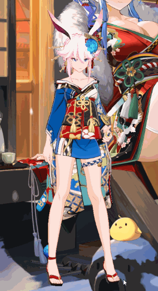

# Yae Sakura Desktop Mascot

- [八重樱桌宠，从玩游戏到做游戏](#八重樱桌宠从玩游戏到做游戏)
- [Features](#Features)
- [Issues](#Issues)
- [TODO](#TODO)
- [解决GitHub下载过慢](#解决GitHub下载过慢)
- [联系方式](#联系方式)

## 八重樱桌宠，从玩游戏到做游戏。

本项目的起因仅仅是因为我想把老婆放在桌面上，如果能帮助一些有兴趣但是没有基础的同学进入行业（Unity、游戏开发、Windows开发、Python、图形学等）也是极好的。

桌宠的完善依靠各位路过的舰长的努力，如语音配对、表情等，在此感谢愿意伸出援手的舰长们。

知乎专栏中做了一些技术细节的讲解：https://zhuanlan.zhihu.com/UnityGraphicsWaifu

## **Features**
- **美术素材来自崩坏3，特别感谢miHoYo，仅可以兴趣和同人为目的使用，禁止任何商业或低俗用途，否则后果自负**
- 操作说明：
  - 左键触摸
  - 右键旋转视角
  - 按住滚轮平移
  - 滑动滚轮缩放
- 托盘图标：
  - 双击图标显示桌宠
  - 置顶显示
  - 开机自启
  - 重置桌宠位置
  - 查看文档，打开GitHub项目页面
  - 手动检查更新
- 内置崩坏3中八重樱所有**白色气泡**触摸动作（包括**特殊**触摸）和语音（语音配对：MEMAUS、蹲街，式寂寞、想和陈sir啵嘴）
- 含大部分表情（表情K帧：MEMAUS、夜星Noel）
- 完善的物理效果（Dynamic Bone）
- 角色Shader根据UTS2修改而成
- 支持半透明特效、后处理、抗锯齿
- 每周自动检查更新
- 暂且仅支持win10、单屏幕

# Issues

- 960M ( ? ) 之前的移动版显卡无法运行

## TODO
- 支持多屏、多角色
- 进阶语音，随时间、节假日、活跃度、天气等改变的**蓝色气泡**语音（？）

## 解决GitHub下载过慢

可以通过修改Host解决GitHub下载过慢的问题（一些特殊网络环境如公用网络可能无效？），如果你不想了解细节步骤，请复制项目根目录下的**hosts**文件覆盖至**c:\windows\system32\drivers\etc**目录。

如果你已有自定义的host，请使用[DNS查询工具](http://tool.chinaz.com/dns/?type=1&amp;host=github.com&amp;ip=)查询：

> github.com  
> github.global.ssl.fastly.net  
> codeload.github.com  
> assets-cdn.github.com

这几个网址并将延迟最低的IP连同域名写入**c:\windows\system32\drivers\etc**中**hosts**文件末尾，注意中间的空格，例如：

> 52.74.223.119  github.com  
> 69.171.248.65 github.global.ssl.fastly.net  
> 54.251.140.56 codeload.github.com  
> 185.199.111.153 assets-cdn.github.com

## 联系方式

B站、知乎：喵刀Hime  
技术群：待建  
粉丝群：635385414  
公众号：JasonMa233